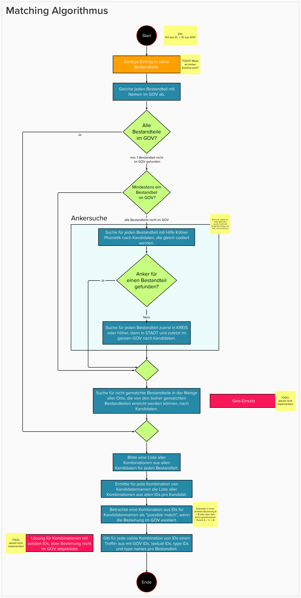

# compgen-ii-cgv

[![](https://img.shields.io/badge/CORRELAID-PROJECT-75A777?style=flat&labelColor=555555&logo=data:image/svg;base64,PHN2ZyB4bWxucz0iaHR0cDovL3d3dy53My5vcmcvMjAwMC9zdmciIHZpZXdCb3g9IjAgMCA1MTUgNjQ1Ij48ZGVmcz48c3R5bGU+LmNscy0xLC5jbHMtMTAsLmNscy0xN3tmaWxsOiNmZmY7fS5jbHMtMntmaWxsOiM5NmMzNDI7fS5jbHMtM3tmaWxsOiNiY2QyNTk7fS5jbHMtNHtmaWxsOiM3OGE5NzI7fS5jbHMtNXtmaWxsOiM1Mzg3OTQ7fS5jbHMtNntmaWxsOiMzODY0YTM7fS5jbHMtN3tmaWxsOiMyMTRmOGY7fS5jbHMtOHtmaWxsOiM2ZmEwN2Y7fS5jbHMtOXtmaWxsOiNhYWNhNDg7fS5jbHMtMTB7Zm9udC1zaXplOjkwcHg7Zm9udC1mYW1pbHk6Um9ib3RvLVJlZ3VsYXIsIFJvYm90bztsZXR0ZXItc3BhY2luZzowLjExZW07fS5jbHMtMTF7bGV0dGVyLXNwYWNpbmc6MC4xZW07fS5jbHMtMTJ7bGV0dGVyLXNwYWNpbmc6MC4xZW07fS5jbHMtMTN7bGV0dGVyLXNwYWNpbmc6MC4xMWVtO30uY2xzLTE0e2xldHRlci1zcGFjaW5nOjAuMTFlbTt9LmNscy0xNXtsZXR0ZXItc3BhY2luZzowLjA5ZW07fS5jbHMtMTZ7bGV0dGVyLXNwYWNpbmc6MC4xZW07fS5jbHMtMTd7Zm9udC1zaXplOjI3MC44cHg7Zm9udC1mYW1pbHk6J1JvYm90byBMaWdodCcsIFJvYm90bztsZXR0ZXItc3BhY2luZzowLjE1ZW07fS5jbHMtMTh7bGV0dGVyLXNwYWNpbmc6MC4xNmVtO308L3N0eWxlPjwvZGVmcz48dGl0bGU+Q29ycmVsQWlkX0RhY2gtemVudHJpZXJ0LW5lZy13aGl0ZTwvdGl0bGU+PGcgdHJhbnNmb3JtPSJ0cmFuc2xhdGUoLTYyMCwwKSI+CiAgICA8cGF0aCBjbGFzcz0iY2xzLTEiIGQ9Ik04MjguMjMsMjc3Ljc3djkwLjc2bDk5LjU0LDg5LjYzaDIwMC4zVjYzOC4yOUg4MjguNmwtLjM3LS4zM0w2MjguNzUsNDU4LjM0bC0uNzMtLjY1VjE4OC42MmwuNzUtLjY3TDgyOC4yMyw4LjM1bC41OS0uNTNoMjk5LjI1VjE4OEg5MjhaIi8+PHBhdGggY2xhc3M9ImNscy0xIiBkPSJNMTEzNS44OSw2NDYuMTFIODI1LjYybC0yLjYtMi4zMkw2MjIuODIsNDYzLjUybC0yLjYxLTIuMzNWMTg1LjEybDMuMzQtM0w4MjUuODIsMGgzMTAuMDdWMTk1Ljc3SDkzMWwtOTQuOTMsODUuNDh2ODMuOGw5NC43Miw4NS4yOWgyMDUuMTJaTTgzMS42LDYzMC40N2gyODguNjVWNDY2SDkyNC43N0w4MjAuNDEsMzcyVjI3NC4yOUw5MjUsMTgwLjEzaDE5NS4yN1YxNS42NEg4MzEuODJsLTE5NiwxNzYuNDZWNDU0LjJaIi8+PHBvbHlnb24gY2xhc3M9ImNscy0yIiBwb2ludHM9IjExMjguMDcgMTIuNTYgMTEyOC4wNyAxODMuNjIgOTUwLjQyIDc2LjQyIDExMjguMDcgMTIuNTYiLz48cG9seWdvbiBjbGFzcz0iY2xzLTMiIHBvaW50cz0iMTExNi43MiA4LjM0IDk0MS43OCA3MS4yMiA4MzcuNTggOC4zNCAxMTE2LjcyIDguMzQiLz48cG9seWdvbiBjbGFzcz0iY2xzLTQiIHBvaW50cz0iOTI0LjU0IDE5MS41OCA4MzEuMzYgMjc1LjQ4IDYzNy4wOCAxODkuMDYgODc2LjAxIDEwMy4xOCA5MjQuNTQgMTkxLjU4Ii8+PHBvbHlnb24gY2xhc3M9ImNscy0yIiBwb2ludHM9IjExMjAuOTYgMTg4LjQ3IDkzMS43NCAxODguNDcgODgzLjQzIDEwMC41IDk0MC45MiA3OS44NCAxMTIwLjk2IDE4OC40NyIvPjxwb2x5Z29uIGNsYXNzPSJjbHMtNSIgcG9pbnRzPSIxMTE5LjE0IDQ1OC42OCA5MzkuOTMgNTY2LjgyIDg4NC40NSA1NDYuODggOTMyLjg3IDQ1OC42OCAxMTE5LjE0IDQ1OC42OCIvPjxwb2x5Z29uIGNsYXNzPSJjbHMtNiIgcG9pbnRzPSIxMTI4LjA3IDQ2Mi40MyAxMTI4LjA3IDYzNC40NSA5NDkuNDEgNTcwLjI0IDExMjguMDcgNDYyLjQzIi8+PHBvbHlnb24gY2xhc3M9ImNscy03IiBwb2ludHM9IjExMTcuMDkgNjM4LjgxIDgzNS43OCA2MzguODEgOTQwLjgxIDU3NS40MyAxMTE3LjA5IDYzOC44MSIvPjxwb2x5Z29uIGNsYXNzPSJjbHMtNiIgcG9pbnRzPSI4NzMuMTkgNTUxLjE0IDgyNy4yNSA2MzQuOCA4MjUuNCA2MzUuOTIgNjM2LjkyIDQ2Ni4yIDg3My4xOSA1NTEuMTQiLz48cG9seWdvbiBjbGFzcz0iY2xzLTUiIHBvaW50cz0iOTI1LjIxIDQ1Ni4zNyA4NzcgNTQ0LjIgNjM2LjYzIDQ1Ny44IDgzMC44NSAzNzEuNDIgOTI1LjIxIDQ1Ni4zNyIvPjxwb2x5Z29uIGNsYXNzPSJjbHMtOCIgcG9pbnRzPSI4MjguMjMgMjgyLjY1IDgyOC4yMyAzNjQuMDEgNjI4LjAyIDQ1My4wNSA2MjguMDIgMTkzLjYxIDgyOC4yMyAyODIuNjUiLz48cG9seWdvbiBjbGFzcz0iY2xzLTMiIHBvaW50cz0iODcyLjIgOTYuMjQgNjM3LjUxIDE4MC41OSA4MjUuNTUgMTEuMjkgODcyLjIgOTYuMjQiLz48cG9seWdvbiBjbGFzcz0iY2xzLTkiIHBvaW50cz0iOTMyLjMgNzQuNjIgODc5LjYyIDkzLjU2IDgzNy45OSAxNy43MiA5MzIuMyA3NC42MiIvPjxwb2x5Z29uIGNsYXNzPSJjbHMtNiIgcG9pbnRzPSI5MzEuMzEgNTcyLjAxIDg0MC41OSA2MjYuNzUgODgwLjY0IDU1My44MiA5MzEuMzEgNTcyLjAxIi8+CjwvZz48L3N2Zz4=)](https://github.com/CorrelAid/)  


Ziel des Projektes ist es, historische Ortsnamen in den Verlustlisten des 1. Weltkrieges zu vereinheitlichen.

Das Python package `compgen2` bietet ein Interface, um Namen und Listen von Namen gegen das GOV abzugleichen und mögliche Matches zu identifizieren. Hierbei wird versucht, häufig vorkommende Fehler wie falsche Schreibweisen oder häufige Verhörer zu korrigieren und so ein Match zu ermöglichen. 

## Setup
Das Python package kann mit dem folgenden Befehl installiert werden:
```
$ pip install -r requirements.txt
```

Danach steht das `compgen2` package bereit zur Nutzung.

### Daten

Die notwendigen Daten können über den folgenden [Link](https://correlcloud.org/index.php/s/iRXKCqQpxwreaMG) aus der Nextcloud geladen werden.

Der Ordner `final_data` enthält die entsprechenden Datenbankauszüge sowie die Verlustliste und die Abkürzungslisten. Den gesamten Ordner als Archiv herunterladen und lokal entpacken. Der Pfad zu diesem Ordner wird als `data_root` für die verschiedenen Anwendungen gebraucht.

Die csv-Dateien `gov_a_{}.csv` können alternativ per [aktuellem Auszug](https://github.com/CorrelAid/compgen-ii-cgv/blob/main/sql/README_SQL.md) von der Datenbank erstellt werden.

## Quickstart
`compgen2` bietet für Anwender ein Kommandozeilen-Interface sowie Klassen, die im Code importiert werden können.

### `compgen2` über die Kommandozeile

`compgen2` stellt den gleichnamigen Befehl `compgen2` für die Kommandozeile bereit.

Der Aufruf 
```
$ compgen2 -h
```

zeigt das Interface. 

Grundsätzlich werden zwei Modi unterstützt:
- `-i`: interaktiv. In diesem Modus wird das `Gov` nur am Anfang geladen und der Benutzer kann über die Kommandozeile jeweils einen Ortsnamen eingeben und bekommt dann mögliche Treffer angezeigt.
- `-f`: Dateiliste. In diesem Modus liest das Programm alle Namen aus einer TXT Datei ein und speichert das Ergebnis als JSON in eine Datei Namens `compgen2.json`.

Für beide Modi ist die Angabe eines Ordners mit der Gov-Datenbank notwendig. Dies geschieht als Pfadangabe über den Parameter `-d`.

### `compgen2` package

Das Python package `compgen2` kann mittels `import compgen2` Anweisung geladen werden.

Es stehen im Wesentlichen die Klassen `Gov`, `Matcher` und `Preprocessing` bereit, sowie einige Hilfsmethoden.

Die genaue Verwendung dieser Klassen zeigen die **showcase** notebooks.

Die grundlegende Verwendung des Matching-Algorithmus sieht wie folgt aus:

```Python
from compgen2 import Gov, Matcher

data_root = "data"
gov = Gov(data_root)
matcher = Matcher(gov)

matcher.get_match_for_locations(["location1", "location2"])

matcher.results
```

## Matching Algorithmus



## Erkenntnisse aus dem Projekt

Alle während des Projektes gesammelten Erkenntnisse wurden im [GitHub Wiki](https://github.com/CorrelAid/compgen-ii-cgv/wiki) gesammelt.

Unter anderem findet sich dort auch eine [Sammlung](https://github.com/CorrelAid/compgen-ii-cgv/wiki/21-Geschichtliches-Ortsverzeichnis--(Findings)) von Lücken, Unregelmäßigkeiten und Fehlern im GOV

## Notebooks

- `performance_comparison`: Enthält die Evaluierung unseres Ansatzes auf 3 verschiedenen Test Sets und berechnet die Metriken
- `showcase_levenshtein`: Enthält eine Demo für die Anwendung der Levenshtein-Distanz zum Auffinden von Kandidaten für ein Wort aus einer Liste ähnlicher Wörter.
- `showcase_matcher`: Enthält eine Demo für die Anwendung des Matching-Algorithmus zum Auffinden von möglichen Treffern für einen Ortsnamen im GOV.
- `showcase_preprocessing`: Enthält eine Demo für die Anwendung des Preprocessings zum Verbessern der Auffindbarkeit von Ortsnamen im GOV.
- `showcase_gov`: Enthält eine Sammlung von typischen Aufrufen mit der Gov Klasse
- `showcase_koelner_phonetik`: Enthält eine Einführung in die Kölner Phonetik mitsamt Beispielen ihrer Schwächen und Stärken
- `showcase_synthetic`: Enthält Beispiel-Anwendungen der Synthetic Klasse

## Für Entwickler

### Aktueller Auszug GOV, SQL Dateien
Für einen aktuellen Abzug aus dem GOV und einer Erklärung der SQL Dateien siehe [hier](https://github.com/CorrelAid/compgen-ii-cgv/blob/main/sql/README_SQL.md).

### Arbeiten mit Notebooks dank jupytext

Wir verwenden [jupytext](https://github.com/mwouts/jupytext), um Notebooks in `.ipynb` und `.py` Format zu synchronisieren.

## License information

### Code


The code is licensed by CorrelAid e.V. under a MIT License. Please see LICENSE.md for more detailed information.
